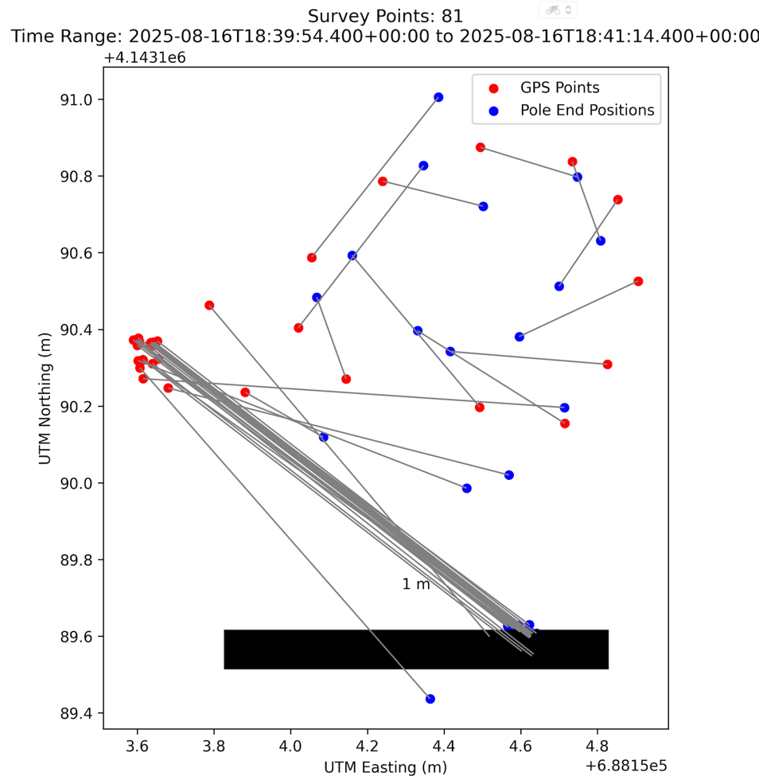

## BOK_SURVEY

# Measure
* [x] in read_from_emlid, read EMLID data from the usb Serial connection (passed with NMEA2 format an print lat, lon, altitude and precise time
* [x] I want a function that detect the name of the EMLID USB file descriptor, working both on Mac OS and raspberry PI
  * Implemented in `bok_survey.find_emlid_device()` - See [emlid_device_detection.md](emlid_device_detection.md) for usage
* [x] In the survey.analysis.gps package, I want a function that takes a GPSPoint object in referentiel from WGS84 GPS coordinates. I want to convert them as a tuple of three float in UTM zone 34 N coordinates, with x, y and z. Use pyproj package
* [x] Implement function `survey.data.load_data` from docstring
* [x] using the same type of structure as `survey_acquire.py`, implement a flask script `survey_analyse` that will read defined survey point between optional timestamps and print a tsv output with timestamp, GPS coordinates, and projected coordinates
* [x] BUG: in `read_from_emlid`, we must read the timestamp as being time and date. Not only time. date is exposed in RMC or ZDA messages
* [ ] Bluetooth detection and robustness
* [ ] align time synchronization between angle and GPS

* [ ] check that GGA GPS point are FIXed by base
* [ ] add GPS quality measure (SINGLE, FIX, RTK, None etc.)

## Analysis

* [x] In projector.py, a function
  * shall take a BNO08x quaternion, a tuple of three float in UTM zone coordinates (with x, y and z), and a pole length.
  * The pole has to end A and B
  * The GPS position is at end A of the pole
  * The BNO08x quaternion is the measure of the pole inclination (v_nat = Vector(1, 0, 0)), showing the direction between A and B
  * The function must return the position as a tuple (x,y,z)  of the position at the end B of the pole
* [x] Implement `plot_projected_measures` following docstring

## Raspberry
* go for RPi pico model